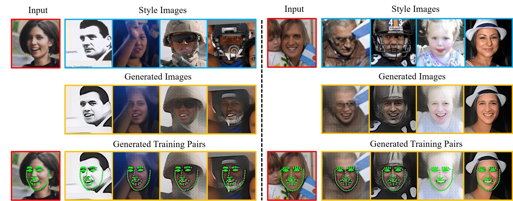

# Aggregation via Separation: Boosting Facial Landmark Detector with Semi-Supervised Style Translation

[Shengju Qian](http://thesouthfrog.com/about.me/),
[Keqiang Sun](https://keqiangsun.github.io/),
[Wayne Wu](https://wywu.github.io),
[Chen Qian](https://scholar.google.com/citations?user=AerkT0YAAAAJ&hl=en),
and [Jiaya Jia](http://jiaya.me/)

[International Conference on Computer Vision (ICCV), 2019](http://iccv2019.thecvf.com/)

This repository contains the implementation of our ICCV 2019 paper, '[Aggregation via Separation: Boosting Facial Landmark Detector with Semi-Supervised Style Translation](https://arxiv.org/pdf/1908.06440.pdf)'.
The proposed method investigates how to boost the performance of facial landmark detector in limited training resources, using synthetic data in a style-translation manner.



**Results(NME/%) on WFLW dataset**

| Method | Fullset | Pose | Expression | Illumination | Make-up | Occlusion | Blur |
| :-----------------: | :-----------: | :------: | :------: | :------: | :------: | :------: | :------: |
| DVLN | 6.08 | 11.54 | 6.78 | 5.73 | 5.98 | 7.33 | 6.88 |
| LAB | 5.27 | 10.24 | 5.51 | 5.23 | 5.15 | 6.79 | 6.32 |
| SAN | 5.22 | 10.39 | 5.71 | 5.19 | 5.49 | 6.83 | 5.80 |
| WING | 5.11 | 8.75 | 5.36 | 4.93 | 5.41 | 6.37 | 5.81 |
| ResNet-18 | 6.09 | 10.76 | 6.97 | 5.83 | 6.19 | 7.15 | 6.67 |
| **AVS(ResNet-18)** | 5.25 | 9.10 | 5.83 | 4.93 | 5.47 | 6.26 | 5.86 |
| **AVS(LAB)** | **4.76** | **8.21** | **5.14** | **4.51** | **5.00** | **5.76** | **5.43** |
| **AVS(SAN)** | **4.39** | **8.42** | **4.68** | **4.24** | **4.37** | **5.60** | **4.86** |

We provide a synthetic WFLW dataset generated by this method here [Google Drive](https://drive.google.com/file/d/1bddYn6zQHFORKqZXm5vYTwB4Mn2UKwGb/view?usp=sharing) or [Baidu Drive](https://pan.baidu.com/s/1cJl_sL7NoQFApomTTv6-ew).

In the provided dataset, each image is augmented with eight different styles in the original WFLW dataset. You may
download from this link and are able to produce similar to re-produce the results reported in our paper.

For example, you can train a SAN(CVPR 2018) model using our script.

### Prerequisites and Installation
- Python 3.6
- Tensorflow 1.2.1
- CUDA 8.0 and CuDNN 5.1

#### Getting Started
**Clone this repository:**
```bash
git clone git@github.com:TheSouthFrog/stylealign.git
cd stylealign
```
**Install dependencies using Anaconda:**
 ```bash
conda create -n stylealign python=3.6
source activate stylealign
pip install -r requirements.txt
```
Note this implementation, we use [variational u-net](https://github.com/CompVis/vunet/tree/tf12legacy) as network structure as it produces sharper results.

As it uses a deprecated API of data dependent initialization which requires legacy version of CUDA 8.0 and CuDNN 5.1 without backward compatibility.
**Prepare Dataset**
 - You may the original cropped WFLW dataset here [Google Drive](https://drive.google.com/file/d/1nZmjlwVSJxI8_W27LpjPJa6K_M_gmTXS/view?usp=sharing) or [Baidu Drive](https://pan.baidu.com/s/1fzizdQ3FRBRwfJjGRvw8gA).
 - Unzip downloaded files. Remember to change the ***data_dir*** and ***image_list*** to your image directory and annotation file, respectively.

### Running the code:
Assume that you have installed multiple versions of CUDA and CuDNN.
By switching the environment to run our code, you need to find out the directory where you have installed the right version and run(for example):

```bash
export LD_LIBRARY_PATH=/usr/local/cuda-8.0/lib64
```

Then run:

```bash
CUDA_VISIBLE_DEVICES=gpu_id python main.py --config config/exp_0001.yaml
```

**Generate style-augmented samples**

```bash
CUDA_VISIBLE_DEVICES=gpu_id python main.py --checkpoint XXXXXX --config config/test_0001.yaml
```

For acceleration, we use the transfer pass to perform testing, where every image in a batch(batch size: ***n***) outputs ***n*** samples under different styles in this batch(n<sup>2</sup> in single pass).

```gen_landmark.py``` is used to generate seperated images and corresponding labels of synthetic images according to transfer images and given order in original annotation files.
- ```--label_file```: The annotation file that used for testing.
- ```--checkpoint_iter```: Trained Iteration of the testing checkpoint.
- ```--batch_size```: Testing batch size.
- ```--gen_dir``` and ```--out_dir```: Testing directory and Output directory.

### Contact
If you have any questions, please feel free to contact the authors.
Shengju Qian sjqian@cse.cuhk.edu.hk

### Citation

If you use our code, please consider citing our paper:

```
@inproceedings{qian2019aggregation,
  title={Aggregation via Separation: Boosting Facial Landmark Detector with Semi-Supervised Style Translation},
  author={Qian, Shengju and Sun, Keqiang and Wu, Wayne and Qian, Chen and Jia, Jiaya},
  journal={ICCV},
  year={2019}
}
```
